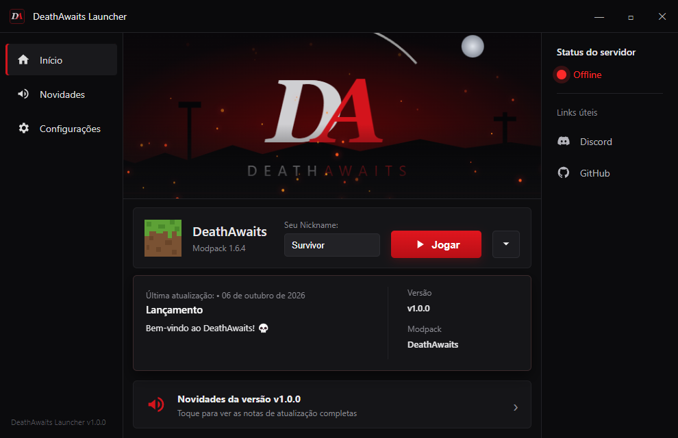

# DeathAwaits Launcher

**Launcher autônomo do modpack DeathAwaits — Minecraft 1.6.4 + Forge**
Aceita conta **pirata (offline)** e **original (Microsoft)**. Java e Minecraft embutidos: é só abrir e jogar.

## ⬇️ Baixar

Vá em **[Releases](https://github.com/ryan1235/DeathAwaits/releases/latest)** e escolha:

| Arquivo | Para quê |
|---|---|
| `DeathAwaits-Launcher-Setup-*.exe` | Instala com atalho na área de trabalho (recomendado) |
| `DeathAwaits-Launcher-Portable-*.exe` | Roda direto, sem instalar |

> O Windows pode mostrar o aviso do SmartScreen na primeira vez (o launcher não é assinado digitalmente). Clique em **Mais informações → Executar assim mesmo**.

## ✨ Recursos

- 🎮 **Conta pirata e original** — nickname offline ou login Microsoft
- ☕ **Java embutido** — escolhe o Java certo para a versão do Minecraft (8 / 17 / 21) e detecta os que você já tem
- 📦 **Modpack automático** — baixa, instala e atualiza mods e Forge sozinho
- 🛡️ **Integridade** — confere o launcher e todos os arquivos do modpack e repara o que estiver corrompido
- 🧭 **Primeiro uso guiado** — checa o PC, sugere a memória ideal e faz o primeiro download
- 📰 **Novidades** — versão e notas de atualização vêm das Releases do GitHub (Markdown, ícones e imagens)
- 🔄 **Auto-update** do launcher
- ⚙️ Memória RAM, tela cheia, tamanho da janela, argumentos da JVM, logs e muito mais
- 🫥 O launcher some quando o jogo abre e volta quando você fecha o Minecraft

## 💻 Requisitos

- Windows 10/11 64 bits
- 4 GB de RAM (recomendado 8 GB ou mais) e ~2 GB livres em disco

## 💬 Suporte

Dúvidas ou problemas? Entre no [Discord](https://discord.gg/gc73gQfb5F).

---

Feito com 💀 para a comunidade DeathAwaits

